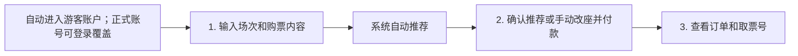

# 用户操作流程

我们把自动发生的环节单独标出来，不算进用户需要做的三步。当前演示默认进入游客账户，用户无需先注册即可跑完整流程；D 接入正式登录后，登录账号会覆盖游客会话。推荐由系统自动完成，用户不需要再点一层页面等结果。

## 每一步放什么

| 步骤 | 页面内容 | 用户操作 |
| --- | --- | --- |
| 1. 输入 | 场次、票种、人数、偏好，以及儿童、老人、无障碍复选框 | 修改后直接出现推荐 |
| 2. 确认 | 推荐理由、Canvas 座位图、总价、模拟支付 | 接受推荐或手动改座；可立即支付，也可保留订单稍后支付 |
| 3. 查看 | 订单状态、座位号、取票号 | 查看结果；后续可取消预订或退票 |

无障碍模式做成全局开关；开启时自动勾选无障碍座位需求并切换为后排优先。管理员后台从导航进入，不塞进普通用户的购票主线。

实现时我们可以用同一页分区或步骤条完成三步，不必为了凑流程额外跳页。这样更符合题目“别让用户思考”的要求。
