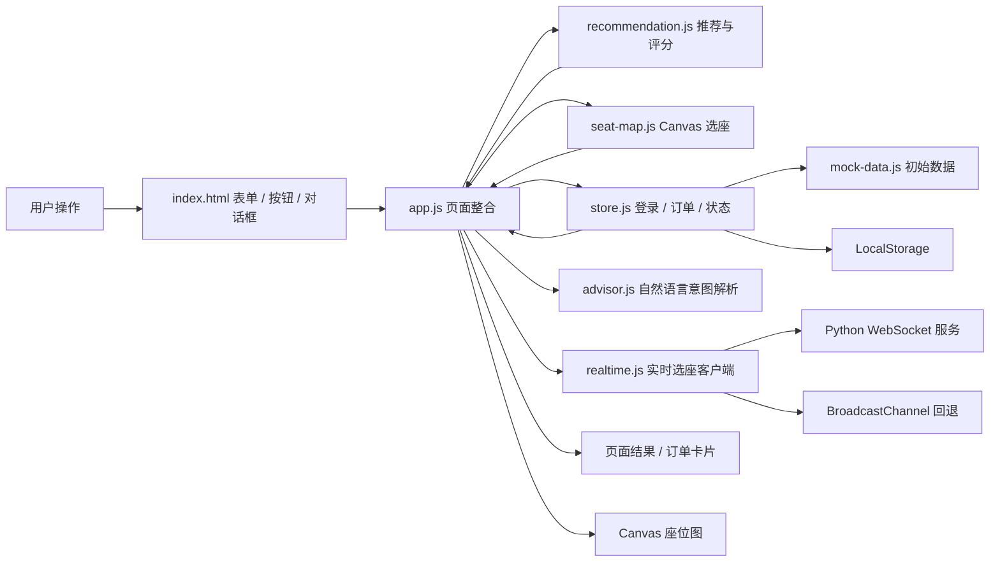

# SmartCinema 项目架构与 D 模块交接指南

这份文档回答三个问题：

1. D 开始开发前，项目原来的文件架构是什么？
2. D 修改了哪些文件，分别增加了什么功能？
3. 第一次接触这个项目时，应该按什么顺序阅读和调试？

## 一、口径说明

本文所说的“改动前”，指的是：

- 远端 `origin/dev` 分支中 A、B、C 已完成并联调后的版本；
- D 从这个版本新建本地 `feature/ui-accessibility` 分支；
- 不是功能仍为占位状态的旧 `main` 版本。

D 的改动目前保留在本地工作区，没有执行提交、推送或创建 PR。

## 二、项目整体目录

```text
SmartCinema/
├─ 00_题目材料/
│  └─ 作业说明.docx
├─ 01_产品与需求/
│  ├─ README.md
│  ├─ 任务分工建议.md
│  └─ 需求拆解.md
├─ 03_源码/
│  ├─ index.html
│  ├─ css/
│  │  └─ style.css
│  ├─ js/
│  │  ├─ advisor.js
│  │  ├─ app.js
│  │  ├─ mock-data.js
│  │  ├─ recommendation.js
│  │  ├─ realtime.js
│  │  ├─ seat-map.js
│  │  └─ store.js
│  ├─ debug-recommendation.html
│  └─ test-store.html
├─ 04_测试与验收/
│  ├─ advisor.test.mjs
│  ├─ accessibility-settings.test.mjs
│  ├─ d-ui-acceptance.md
│  ├─ realtime-websocket.test.mjs
│  ├─ requirements-static.test.mjs
│  ├─ seat-map-drag.test.mjs
│  └─ 功能要求审查报告.md
├─ scripts/
│  ├─ realtime-server.py
│  └─ start-preview.ps1
├─ 05_提交材料/
│  └─ 提交清单.md
├─ docs/
│  ├─ feature-checklist.md
│  ├─ user-flow.md
│  ├─ data-schema.md
│  ├─ booking-flow.md
│  ├─ recommendation-api.md
│  ├─ task-assignment.md
│  ├─ collaboration.md
│  ├─ ai-usage-report.md
│  └─ contributions/
├─ C_function_interface.md
├─ C_draft.md
├─ README.md
└─ 启动预览.cmd
```

目录可以分成四层：

| 层次 | 主要目录或文件 | 用途 |
| --- | --- | --- |
| 作业与需求 | `00_题目材料`、`01_产品与需求`、`docs` | 说明要做什么、字段怎么约定、成员如何协作 |
| 正式页面 | `03_源码/index.html`、`css/style.css` | 页面结构和视觉样式 |
| 业务模块 | `03_源码/js/*.js` | 推荐、Canvas、订单、登录和页面接线 |
| 测试与提交 | `debug-recommendation.html`、`test-store.html`、`04_测试与验收`、`05_提交材料` | 单模块调试、整体验收和最终提交 |

## 三、D 改动前的源码架构

改动前已经不是空项目。A、B、C 提供了完整的业务能力，D 的工作重点是把它们整理成正式可演示的产品页面。

### 1. `index.html`：页面骨架

原页面已经包含：

- 场次、票种、人数、偏好和特殊需求表单；
- Canvas 座位图；
- 热度显示开关；
- 推荐结果区域；
- 订单卡片区域；
- 模拟支付对话框；
- 顶部账号摘要和一个简单的“无障碍模式”按钮。

当时主要缺少：

- 正式登录和注册入口；
- 账号切换界面；
- 管理员视图的明确提示；
- 订单筛选和分页；
- 大字体、高对比度、色盲友好等独立设置；
- 完整的响应式细节和统一视觉。

### 2. `style.css`：基础三栏布局

原样式提供了：

- 浅色卡片式三栏布局；
- 表单、Canvas、图例、订单卡片和支付框的基础样式；
- `1180px` 和 `720px` 两个简单断点；
- 基本的手机单列布局。

它可以演示功能，但还没有形成统一的影院产品视觉，也没有真正实现多种无障碍主题。

### 3. `app.js`：页面整合入口

`app.js` 原本已经负责：

- 初始化 Store；
- 读取场次、电影、影厅和座位状态；
- 调用 B 的推荐算法；
- 把推荐结果交给 A 的 Canvas；
- 响应表单条件变化；
- 创建订单、支付、取消和退票；
- 渲染库存、账号摘要和订单卡片；
- 控制热度日期和 Canvas 热度图。

它是页面层的“总调度器”，但不是数据源，也不应该自己实现推荐或订单状态机。

### 4. `mock-data.js`：演示数据

该文件提供：

- 100、200、300 座的三个影厅；
- 电影和场次；
- 用户和管理员演示账号；
- 各场次座位状态；
- 热度数据；
- 演示订单。

主要演示账号：

```text
普通用户：testuser / 123456
管理员：admin / admin123
游客：guest（页面自动进入，不需要密码）
```

### 5. `recommendation.js`：B 的推荐和评分模块

主要公开接口：

```js
recommendSeats()
evaluateViewingExperience()
debugRecommendation()
getDefaultRecommendation()
```

负责：

- 个人、情侣、家庭、团体的连座推荐；
- 儿童、老人和无障碍限制；
- 中间、后排、过道等偏好；
- 推荐座位和备选座位；
- 体验分数、等级、推荐区域和理由。

这个文件只计算结果，不负责改变座位状态或创建订单。

### 6. `seat-map.js`：A 的 Canvas 组件

主要公开接口：

```js
createSeatMap()
drawSeatMap()
```

负责：

- 按影厅 `pattern` 绘制弧形座位；
- 可选、已选、锁定、已售、无障碍等状态；
- 推荐高亮；
- 热度底色；
- 鼠标选座、拖拽和 Ctrl/Cmd 多选；
- 方向键移动、Enter/空格选座；
- 把 `selectedSeatIds` 交回 `app.js`。

这个文件只维护当前页面的临时选择，不直接修改订单或 LocalStorage。

### 7. `store.js`：C 的状态和持久化模块

主要入口：

```js
createStore()
store
```

负责：

- 初始化和恢复 LocalStorage；
- 用户注册、登录、退出和权限判断；
- 查询电影、场次和影厅；
- 创建订单并锁座；
- 模拟支付、取消订单和退票；
- 维护 `available / reserved / sold` 座位状态；
- 15 分钟锁票计时；
- 查询订单和管理员权限过滤；
- 热度数据。

业务状态发生变化时，应该调用 Store 的公开方法，不能在 `app.js` 里直接修改订单数组。

## 四、模块之间怎么连接



最重要的边界：

- `app.js` 负责接线，不重复实现 B、C 的业务逻辑；
- `recommendation.js` 只计算推荐，不锁座；
- `seat-map.js` 只维护临时选座，不创建订单；
- `store.js` 是登录、订单、座位状态和持久化的唯一来源；
  - `mock-data.js` 只提供初始演示数据。


## 五、页面启动后发生了什么

### 启动阶段

```text
1. 浏览器加载 index.html
2. index.html 载入 app.js
3. app.js 调用 store.initStore()
4. Store 从 LocalStorage 恢复数据；首次运行则写入 Mock 数据
5. app.js 填充场次、恢复账号无障碍设置
6. app.js 调用 createSeatMap() 创建 Canvas 组件
7. 首次渲染推荐区、订单区、账号摘要和空座位图
8. app.js 注册所有表单、按钮、订单和对话框事件
```

### 选场次和推荐

```text
选择场次
→ app.js 读取 schedule / hall / seatState
→ 组装 recommendationInput
→ 调用 debugRecommendation()
→ 得到推荐座位、评分和理由
→ seatMap.update()
→ Canvas 选中并高亮推荐座位
→ 页面渲染推荐说明
```

### 下单和支付

```text
确认座位
→ store.createOrder()
→ 座位 available 变为 reserved
→ 弹出模拟支付框
→ store.payOrder()
→ 订单变为 purchased
→ 座位 reserved 变为 sold
→ 重绘 Canvas
→ 订单中心显示取票码
```

## 六、D 修改了哪些文件

### 核心源码

| 文件 | 修改类型 | 主要改动 |
| --- | --- | --- |
| `03_源码/index.html` | 大幅修改 | 重构页面结构，新增三步进度、账号中心、注册登录、订单工具栏、无障碍设置和语义化标记 |
| `03_源码/css/style.css` | 大幅修改 | 统一影院视觉、响应式布局、对话框、订单分页、焦点状态和多种无障碍主题 |
| `03_源码/js/app.js` | 功能扩展 | 登录注册、订单筛选分页、无障碍、问答顾问、热度、实时选座与推荐流程接线 |
| `03_源码/js/advisor.js` | 新增模块 | 将自然语言人数、同行成员和座位偏好转换成推荐参数 |
| `03_源码/js/realtime.js` | 新增模块 | 原生 WebSocket 客户端、多人临时选座、冲突排除和 BroadcastChannel 回退 |
| `03_源码/js/seat-map.js` | 功能扩展 | 增加热度配色、色盲/高对比度 Canvas、远端座位、动画和 Ctrl/Cmd 连续区间拖选 |
| `03_源码/js/store.js` | 小范围扩展 | 新增完整无障碍与个性化显示设置的账号持久化接口 |
| `启动预览.cmd` | 稳定性修复 | 使用不含中文路径字面量的轻量入口调用正式启动脚本，避免命令行代码页破坏路径 |
| `scripts/start-preview.ps1` | 新增启动脚本 | 自动发现源码和 Python，检查 HTTP/WebSocket 端口，只打开一个预览页 |
| `scripts/realtime-server.py` | 新增服务 | 仅用 Python 标准库实现 WebSocket 握手、消息帧、快照与广播 |

### 文档

| 文件 | 主要改动 |
| --- | --- |
| `README.md` | 更新当前完成状态、演示账号和后续提交顺序 |
| `docs/task-assignment.md` | 更新 A/B/C/D 的实际接入状态 |
| `docs/contributions/d-ui-accessibility.md` | 记录 D 的工作内容、改动文件、测试和问题处理 |
| `docs/contributions/d-bonus-features.md` | 记录问答、拖拽动画、实时同步和个性化主题 |
| `docs/ai-usage-report.md` | 补充 D 的实际 AI 使用记录和设计判断 |
| `04_测试与验收/d-ui-acceptance.md` | 新增 D 的逐项验收结果 |
| `04_测试与验收/功能要求审查报告.md` | 汇总技术约束、加分项证据、测试和现场演示步骤 |

## 七、D 具体增加的功能

### 1. 正式账号中心

- 顶部账号摘要改为可操作按钮；
- 新增登录/注册 Tab；
- 注册时检查用户名长度、密码长度和两次密码一致性；
- 登录和注册成功后自动刷新订单权限；
- 提供普通用户和管理员快捷演示登录；
- 支持退出正式账号并回到游客模式；
- 管理员显示“管理员视图”，普通用户显示“我的订单”。

### 2. 订单筛选和分页

- 支持全部、待支付、已支付、已取消、已退票筛选；
- 每页显示 3 笔订单；
- 筛选或切换账号时自动回到第 1 页；
- 上一页、下一页按钮按页码禁用；
- 管理员订单显示用户 ID；
- 保留继续支付、取消和退票操作；
- 对用户可输入内容进行 HTML 转义，避免直接拼入不安全标签。

### 3. 三步购票流程

顶部增加：

```text
1. 选择场次
2. 确认座位
3. 查看订单
```

场次选择、确认座位和创建订单时，步骤状态会自动切换。

### 4. 完整无障碍设置

设置按账号保存，包括：

- 无障碍购票辅助；
- 大字体；
- 高对比度；
- 色盲友好配色；
- 减少动画；
- 浏览器支持时的语音提示。

无障碍购票辅助开启后：

- 自动切换为后排优先；
- 自动勾选“需要无障碍座位”；
- 推荐算法重新计算。

不同账号的设置相互独立，切换账号时自动恢复对应状态。

### 5. Canvas 色盲友好

仅修改 CSS 无法影响 Canvas 内部颜色，因此 D 给 `createSeatMap()` 增加两个可选参数：

```js
colorBlindFriendly
reduceMotion
```

色盲模式中除了换色，还使用图形区分：

- 已选：中心白点；
- 锁定：白色横线；
- 已售：白色叉号；
- 无障碍位：方形和 `W` 标记。

默认不传参数时，A 原有选座接口和行为保持不变。

### 6. 响应式和视觉

- 大屏：购票条件、Canvas、推荐/订单三列；
- 中屏：左侧条件 + 右侧 Canvas，推荐和订单移到下一行；
- iPad 横向/1024px：条件与 Canvas 双列，推荐和订单移到下一行；900px 以下改为单列；
- 手机：缩小卡片间距，Canvas 在卡片内部横向滚动；
- 页面本身不会因为 300 座 Canvas 产生横向溢出；
- 增加统一品牌头部、影院背景、屏幕光晕、空状态和按钮反馈。

### 7. 键盘和语义化

- 增加“跳到购票区”链接；
- 表单控件均有可访问名称；
- 对话框、分页和步骤条增加 ARIA；
- 重要状态通过 `aria-live` 通知；
- Canvas 保留方向键和 Enter/空格操作；
- 所有按钮、输入框和 Canvas 都有明显焦点样式；
- 减少动画模式和系统 `prefers-reduced-motion` 均会关闭动画。

### 8. Canvas 热度图

- 热度背景与等高环完全由 Canvas 绘制；
- 正常模式使用红/黄/绿表示热门/一般/冷门；
- 可切换一周内的日期；
- 色盲模式改用紫/黄/蓝，并与状态图形结合。

### 9. AI 观影问答顾问

- 支持“一家四口”“8 人团体”“情侣约会”等表达；
- 识别儿童、老人、轮椅、安静、视角和过道需求；
- 自动选择场次、票种、人数与偏好；
- 复用 B 的推荐算法，不在页面层重新发明评分公式；
- 输出视角、噪音、便捷性和成员规则说明。

### 10. 拖拽动画与实时同步

- Ctrl/Cmd 拖选根据起点和终点计算完整同排区间，不依赖 `pointermove` 采样频率；
- 选择和取消座位有 Canvas 扩散动画；
- WebSocket 广播其他观众的临时选择，自动推荐与手选都会避让；
- 服务不可用时回退到 BroadcastChannel，仍可在本机多标签演示。

### 11. 个性化界面

- 提供午夜青、星河紫、暖金幕三套主题；
- 大字体约放大到 1.38 倍；
- 高对比度使用黑白主色、粗边框和黄色焦点轮廓；
- 设置登录后按账号持久化。

## 八、仍然保持不变的模块边界

D 仍然没有修改：

- `mock-data.js` 的电影、影厅、用户、场次和座位数据；
- `recommendation.js` 的推荐算法和评分公式；
- `store.js` 的订单状态机和原有 LocalStorage key；
- 座位 ID 的 `排号-座位号` 规则；
- 真实支付和后端数据库。

`store.js` 只增加了完整显示设置的持久化接口；WebSocket 只同步“正在选择”的临时状态，不替代 Store 的订单锁座与支付状态机。因此如果推荐规则不对，先检查 `recommendation.js`；如果订单状态不对，先检查 `store.js`。

## 九、第一次接手项目的推荐阅读顺序

### 第一遍：先理解“要做什么”

按下面顺序阅读：

1. `README.md`
   - 看运行方式、演示账号和当前完成状态。
2. `docs/feature-checklist.md`
   - 看老师要求的必做功能。
3. `docs/user-flow.md`
   - 看用户三步主流程。
4. `docs/data-schema.md`
   - 看用户、场次、影厅、座位、推荐和订单字段。
5. `docs/task-assignment.md`
   - 看 A/B/C/D 的职责边界。
6. `docs/booking-flow.md`
   - 看预订、支付、取消和退票如何改变状态。

这一遍先不要钻进算法细节，目标是知道数据从哪里来、最后要演示什么。

### 第二遍：理解页面怎么串起来

1. 先看 `03_源码/index.html`
   - 只看页面区域和各控件的 `id`。
2. 再看 `03_源码/js/app.js`
   - 先看顶部 DOM 查询和页面状态；
   - 再看事件监听；
   - 再搜索下面这些函数：

```text
populateSchedules
applyAutomaticRecommendation
handleSelectionChange
renderRecommendation
openPaymentDialog
renderOrders
handleOrderAction
handleLogin
handleRegister
saveAccessibilitySettings
```

3. 最后看 `03_源码/css/style.css`
   - 先看变量；
   - 再看三栏布局；
   - 再看订单和对话框；
   - 最后看无障碍类和媒体查询。
4. 如果要理解加分功能，再看：
   - `advisor.js`：自然语言如何转成推荐条件；
   - `realtime.js`：浏览器如何同步临时座位；
   - `scripts/realtime-server.py`：服务端如何广播。

### 第三遍：分别理解 A/B/C

建议顺序：

1. `docs/recommendation-api.md`
2. `recommendation.js`
3. `C_function_interface.md`
4. `store.js`
5. `seat-map.js`
6. `mock-data.js`

原因：

- 先看接口文档，知道输入输出；
- 再看实现，不容易陷入内部辅助函数；
- `mock-data.js` 内容很多，最后看即可。

## 十、根据问题快速定位文件

| 遇到的问题 | 优先查看 |
| --- | --- |
| 页面区域、按钮、对话框不存在 | `index.html` |
| 颜色、间距、移动端错位 | `style.css` |
| 按钮点了没反应、页面没有刷新 | `app.js` |
| 推荐座位、年龄规则、评分不对 | `recommendation.js`、`recommendation-api.md` |
| Canvas 点不中、座位画错、键盘失效 | `seat-map.js` |
| 登录、订单、支付、退票、LocalStorage 不对 | `store.js`、`C_function_interface.md` |
| 顾问人数或偏好理解错误 | `advisor.js`、`app.js` |
| 多人状态没有同步 | `realtime.js`、`scripts/realtime-server.py`、页面实时状态 |
| 影厅容量、电影、场次或测试账号不对 | `mock-data.js` |
| 不知道功能是否完成 | `feature-checklist.md`、`contributions/` |

## 十一、如何运行和调试

### 运行

推荐双击根目录：

```text
启动预览.cmd
```

启动器会同时启动：

```text
HTTP 预览：http://127.0.0.1:8080
WebSocket：ws://127.0.0.1:8765
```

如需手动运行，先在项目根目录启动实时服务：

```powershell
python scripts/realtime-server.py
```

再另开一个终端进入 `03_源码`：

```powershell
python -m http.server 8080 --bind 127.0.0.1
```

然后打开：

```text
http://127.0.0.1:8080/index.html
```

不要直接双击 `index.html` 使用 `file://`，因为 ES Module 通常会被浏览器安全策略拦截。

### 启动器报错排查

如果旧版启动器出现下面的错误：

```text
Start-Process：参数“WorkingDirectory”具有无效的值
DirectoryNotFoundException
```

原因通常不是网页代码，而是 `cmd.exe` 用系统代码页读取 UTF-8 批处理文件时，把 `03_源码` 中的中文解析成了乱码。修复后的 `启动预览.cmd` 不再直接依赖中文目录字面量，而是调用 `scripts/start-preview.ps1` 自动寻找项目根目录下包含 `index.html` 的 `03_*` 文件夹。

如果出现“Preview did not start”一类提示，还可能是双击启动器时的普通终端 PATH 与开发工具终端不同：系统可能只找到 Windows Store 的 `python.exe` 占位程序，而没有找到真正的 Python。新的 PowerShell 启动脚本会跳过 WindowsApps 占位程序，并检查 PATH、常见 Python 安装目录以及 MSYS2 的 Python。

使用时要保证：

1. `启动预览.cmd` 仍在项目根目录；
2. 源码目录仍以 `03_` 开头，且其中存在 `index.html`；
3. 已安装 Python 3，终端中至少有 `python`、`python3` 或 `py` 其中一个命令；
4. 端口 `8080` 没有被其他网站占用。
5. 实时模拟还需要端口 `8765` 没有被其他程序占用。

如果启动器仍失败，可以手动运行上面的 WebSocket 和 HTTP 两条命令，分别查看错误。只启动 HTTP 时页面主流程仍可运行，但实时状态会回退为本机多标签模拟。

### 单模块调试

- 推荐算法：打开 `debug-recommendation.html`
- Store 和订单接口：打开 `test-store.html`
- D 整体验收：查看 `04_测试与验收/d-ui-acceptance.md`
- 加分功能与技术约束：查看 `04_测试与验收/功能要求审查报告.md`
- 自动化回归：运行 `advisor.test.mjs`、`accessibility-settings.test.mjs`、`requirements-static.test.mjs`、`seat-map-drag.test.mjs`、`realtime-websocket.test.mjs`

### 浏览器控制台入口

正式页面提供两个调试对象：

```js
window.__store
window.__seatSelection
window.__realtimeSeatClient
```

常用示例：

```js
window.__store.getCurrentUser()
window.__store.getOrders()
window.__seatSelection.getScheduleId()
window.__seatSelection.getSelectedSeatIds()
```

这些入口适合查看状态，不建议直接修改返回的内部对象。

## 十二、继续开发时不要踩的坑

1. 不要改变座位 ID 格式，统一使用 `F-8` 这种形式。
2. 不要另造 LocalStorage key，先看 `docs/data-schema.md`。
3. 不要在 `app.js` 中重复写推荐算法。
4. 不要绕过 Store 直接修改订单和持久座位状态。
5. 不要让 `seat-map.js` 自己创建订单。
6. 修改公共输入输出后，同步更新 `docs`。
7. 测试前注意旧 LocalStorage；静态影厅会自动迁移，但测试订单会保留。
8. 手机端 Canvas 横向滚动是预期设计，不要强行把 300 个座位压缩到看不清。
9. WebSocket 只表示他人“正在选择”，正式锁座、支付和退票仍然必须走 Store。
10. 拖选连续性来自区间计算，不要改回只处理当前 `pointermove` 命中的单个座位。

## 十三、建议的实际入手方式

如果只想尽快看懂并接着开发，可以按这个最短路径：

```text
README
→ feature-checklist
→ user-flow
→ data-schema
→ index.html
→ app.js
→ advisor.js
→ recommendation-api
→ store.js 的公开方法
→ seat-map.js 的 createSeatMap
→ realtime.js / realtime-server.py
→ 浏览器跑一遍游客和管理员流程
```

跑通后再根据自己要改的模块深入，不需要一开始完整读完五个 JavaScript 文件。
